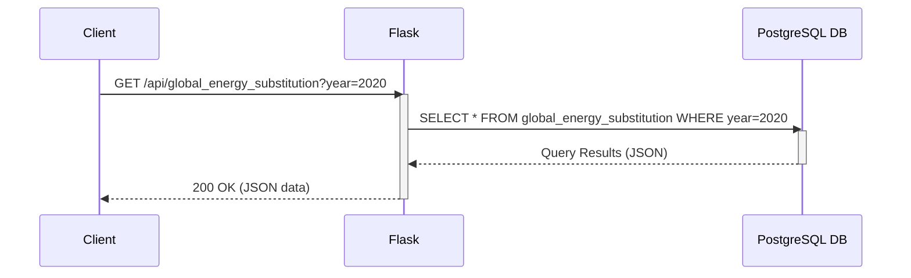
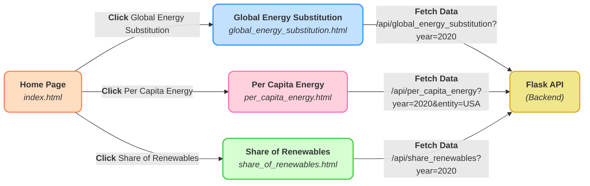

# Energy Data Visualization Project  

    

This repository contains three interactive data visualization projects related to global energy consumption trends. Each visualization provides insights into different aspects of energy usage globally.  

---

## Table of Contents  
- [Project Description](#project-description)  
  - [Purpose](#purpose)  
  - [Goals](#goals)  
  - [Key Features](#key-features)  
- [Visualizations Overview](#visualizations-overview)  
  - [1. Global Primary Energy Consumption by Source](#1-global-primary-energy-consumption-by-source)  
  - [2. Per Capita Primary Energy Consumption by Source](#2-per-capita-primary-energy-consumption-by-source)  
  - [3. Share of Electricity Production from Renewables](#3-share-of-electricity-production-from-renewables)  
- [Technologies Used](#technologies-used)  
- [Installation Instructions](#installation-instructions)  
- [Directory Structure](#directory-structure)  
- [System Architecture](#system-architecture)  
- [Usage](#usage)  
  - [Running the Ingestion Script](#running-the-ingestion-script)  
  - [Running the Flask API](#running-the-flask-api)  
  - [Viewing the Frontend Pages](#viewing-the-frontend-pages)  
- [API Interaction](#api-interaction)  
  - [API Request/Response Sequence Diagram](#api-requestresponse-sequence-diagram)  
- [Frontend Navigation](#frontend-navigation)  
  - [Frontend Navigation/Interaction Diagram](#frontend-navigationinteraction-diagram)  
- [Database Structure](#database-structure)  
- [Configuration](#configuration)  
- [Additional Information](#additional-information)  
  - [Acknowledgments](#acknowledgments)  
  - [Known Issues](#known-issues)  
  - [Future Enhancements](#future-enhancements)  
- [License](#license)  
- [Contact](#contact)  

---

## Project Description  

### Purpose  
This project demonstrates how to:  
1. Programmatically download datasets (in CSV format) from the web.  
2. Ingest and store them in a PostgreSQL database.  
3. Expose the stored data through RESTful API endpoints built with Flask.  
4. Visualize the data using an HTML frontend for easy access.  

### Goals  
- Provide an automated and reproducible process to keep data up to date.  
- Offer clear and concise API endpoints for querying data.  
- Present an intuitive HTML front page to guide users to various visualizations.  

### Key Features  
- Automated ingestion of three distinct CSV datasets related to global energy consumption.  
- PostgreSQL database setup and data population.  
- Flask API endpoints for retrieving data.  
- Basic HTML/CSS layout for data visualization and navigation.  

---

## Visualizations Overview  

### 1. Global Primary Energy Consumption by Source  

This section provides an analysis of trends in primary energy consumption. The visualization presents growth in renewable energy, significant increases in solar and wind energy since the early 2000s, and variations in fossil fuel usage over time.  

#### Overview  
- **Title:** Global Primary Energy Consumption by Source (1800–2023)  
- **Energy Sources:** Coal, oil, gas, renewables, nuclear, and biomass.  
- **Visualization Type:** Stacked area chart.  
- **Data Source:** Energy Institute and Smil (2017).  

  

---

### 2. Per Capita Primary Energy Consumption by Source  

This visualization analyzes the variation in per capita energy use across countries. It highlights differences between industrialized nations and developing economies.  

#### Overview  
- **Title:** Per Capita Primary Energy Consumption by Source (2023)  
- **Energy Sources:** Coal, oil, gas, nuclear, hydro, wind, solar, and other renewables.  
- **Visualization Type:** Stacked bar chart.  
- **Data Source:** Energy Institute - Statistical Review of World Energy (2024).  

  

---

### 3. Share of Electricity Production from Renewables  

This visualization shows how renewable energy shares vary globally, influenced by policies, geography, and economic factors.  

#### Overview  
- **Title:** Share of Electricity Production from Renewables (2023)  
- **Coverage:** Global, with data for individual countries.  
- **Visualization Type:** Choropleth map.  
- **Data Source:** Ember and Energy Institute - Statistical Review of World Energy (2024).  

  

---

## Technologies Used  

- **Python 3**: [Requests](https://pypi.org/project/requests/), [psycopg2](https://pypi.org/project/psycopg2/).  
- **PostgreSQL**: Primary data storage.  
- **Flask**: RESTful API.  
- **HTML/CSS**: Frontend for visualizations.  
- **Mermaid**: Diagram creation.  

---

## Installation Instructions  

1. **Clone the repository**:  
   ```bash  
   git clone https://github.com/your-username/energy-visualizations.git  
   cd energy-visualizations  
   ```  
2. **Set up Python environment**:  
   ```bash  
   python3 -m venv venv  
   source venv/bin/activate  # or venv\Scripts\activate on Windows  
   pip install -r requirements.txt  
   ```  
3. **Set up PostgreSQL**:  
   - Install PostgreSQL.  
   - Create a database (e.g., `energy`).  
   - Update credentials in `ingestion.py` and `app.py`.  

4. **Run the ingestion script**:  
   ```bash  
   python ingestion.py  
   ```  

5. **Start the Flask API**:  
   ```bash  
   python app.py  
   ```  

6. **View Frontend Pages**: Open `index.html` in your browser.  

---

## Directory Structure

```
📁 Energy Insights
├── ingestion.py          # Handles downloading, parsing, and inserting energy datasets into a PostgreSQL database
├── app.py                # REST API for querying energy data from PostgreSQL and returning JSON responses
├── visualization.py      # Generates interactive HTML visualizations of energy datasets using Plotly
├── requirements.txt      # Lists Python dependencies required for the project
└── index.html            # Frontend landing page
├── visualizations/
│   └── global_energy_substitution.html
│   └── per_capita_energy.html
│   └── share_of_renewables.html
```

---

## System Architecture

Understanding the overall system architecture is crucial for navigating and extending the project. Below is a visual representation of how different components interact within the project.

### System Architecture Diagram

```mermaid
%% Modern Themed Flowchart
flowchart LR
style A fill:#FFDDC1,stroke:#FF7F50,stroke-width:2px,rx:10px,ry:10px
style B fill:#C1E1FF,stroke:#1E90FF,stroke-width:2px,rx:10px,ry:10px
style C fill:#FFD1DC,stroke:#FF69B4,stroke-width:2px,rx:10px,ry:10px
style D fill:#D5FFD1,stroke:#32CD32,stroke-width:2px,rx:10px,ry:10px
style E fill:#F0E68C,stroke:#DAA520,stroke-width:2px,rx:10px,ry:10px

A["<b>CSV Data Sources</b><br><i>Our World in Data</i>"] -->|<b>Download CSV</b>| B[<b>Ingestion Script</b><br><i>ingestion.py</i>]
B -->|<b>Insert Into</b>| C[<b>PostgreSQL Database</b>]
C -->|<b>psycopg2 Library</b>| D[<b>Flask API</b><br><i>app.py</i>]
D -->|<b>GET Requests</b>| E[<b>Frontend</b><br><i>index.html</i>]
E -->|<b>Optionally Requests Data</b>| D
D -->|<b>Queries Data</b>| C
```



---

## Usage
This section guides you through running the ingestion script, starting the Flask API, and accessing the frontend interface.
### Running the Ingestion Script
1. **Verify your PostgreSQL credentials** in `ingestion.py` (and ensure your database is running).
2. **Execute the script**:
    ```bash
    python ingestion.py
    ```
    - This script will **create the required tables** if they don’t exist.
    - It will **download the CSV data** from three specified URLs.
    - It will **insert** the data into your local PostgreSQL database.

### Running the Flask API

1. **Ensure your PostgreSQL database is populated** (via the ingestion step).
2. **Start the Flask application**:
    ```bash
    python app.py
    ```
    - By default, the Flask server runs at [http://127.0.0.1:5000](http://127.0.0.1:5000).

### Viewing the Frontend Pages

1. **Open `index.html`** in your web browser.
2. **Explore the homepage**, which includes:
    - A hero section explaining the project’s purpose.
    - Cards linking to specific visualizations (e.g., `global_energy_substitution.html`).

> **Note**: If you have not yet created the individual visualization pages referenced (e.g., `visualizations/global_energy_substitution.html`), those links will lead to placeholders or 404 pages. Add your own HTML/JS files to implement data visualizations.

---

## API Interaction

Understanding how the frontend interacts with the API can help in debugging and extending functionalities.

### API Request/Response Sequence Diagram



---

## Frontend Navigation

The frontend's navigation structure ensures users can easily access different visualizations.

### Frontend Navigation/Interaction Diagram



---

## Database Structure

This project creates and uses three main tables in PostgreSQL. Below is an overview of each table and its columns:

### 1. `global_energy_substitution`

| Column                     | Type                | Description                                      |
|----------------------------|---------------------|--------------------------------------------------|
| **id**                     | SERIAL PRIMARY KEY  | Auto-incrementing primary key                    |
| **entity**                 | TEXT                | Name of the country or entity                    |
| **code**                   | TEXT                | Country code or identifier (if available)        |
| **year**                   | INT                 | Year of the data                                 |
| **other_renewables**       | FLOAT               | Substituted energy from other renewables (TWh)    |
| **biofuels**               | FLOAT               | Biofuels-based energy (TWh)                      |
| **solar**                  | FLOAT               | Solar-based energy (TWh)                          |
| **wind**                   | FLOAT               | Wind-based energy (TWh)                           |
| **hydropower**             | FLOAT               | Hydropower-based energy (TWh)                     |
| **nuclear**                | FLOAT               | Nuclear-based energy (TWh)                        |
| **gas**                    | FLOAT               | Natural gas-based energy (TWh)                    |
| **oil**                    | FLOAT               | Oil-based energy (TWh)                            |
| **coal**                   | FLOAT               | Coal-based energy (TWh)                           |
| **traditional_biomass**    | FLOAT               | Traditional biomass energy (TWh)                  |

### 2. `share_electricity_renewables`

| Column                      | Type                | Description                                           |
|-----------------------------|---------------------|-------------------------------------------------------|
| **id**                      | SERIAL PRIMARY KEY  | Auto-incrementing primary key                         |
| **entity**                  | TEXT                | Name of the country or entity                         |
| **code**                    | TEXT                | Country code or identifier (if available)             |
| **year**                    | INT                 | Year of the data                                      |
| **renewables_pct_electricity** | FLOAT           | Renewables as a percentage of electricity             |

### 3. `per_capita_energy`

| Column                       | Type                | Description                                           |
|------------------------------|---------------------|-------------------------------------------------------|
| **id**                       | SERIAL PRIMARY KEY  | Auto-incrementing primary key                         |
| **entity**                   | TEXT                | Name of the country or entity                         |
| **code**                     | TEXT                | Country code or identifier (if available)             |
| **year**                     | INT                 | Year of the data                                      |
| **coal_per_capita**          | FLOAT               | Coal consumption per capita (kWh)                     |
| **oil_per_capita**           | FLOAT               | Oil consumption per capita (kWh)                      |
| **gas_per_capita**           | FLOAT               | Gas consumption per capita (kWh)                      |
| **nuclear_per_capita**       | FLOAT               | Nuclear consumption per capita (kWh, equivalent)      |
| **hydro_per_capita**         | FLOAT               | Hydropower consumption per capita (kWh, equivalent)   |
| **wind_per_capita**          | FLOAT               | Wind consumption per capita (kWh, equivalent)         |
| **solar_per_capita**         | FLOAT               | Solar consumption per capita (kWh, equivalent)        |
| **other_renewables_per_capita** | FLOAT           | Other renewables per capita (kWh, equivalent)         |

These tables are automatically created (if they do not exist) when you run the ingestion script (`ingestion.py`). Each table is then populated by downloading CSV data from [Our World in Data](https://ourworldindata.org/) and inserting it into the respective columns.

---

## Configuration

Several key configurations are located in the following files:

1. **`ingestion.py`**
    - **URLs** for the CSV datasets:
    ```python
    URL_GLOBAL_ENERGY_SUBSTITUTION  =  "..."
    URL_SHARE_OF_RENEWABLES         =  "..."
    URL_PER_CAPITA_ENERGY           =  "..."
    ```
    - **Database credentials** (defaults shown):
    ```python
    db_host = "localhost"
    db_name = "energy"
    db_user = "postgres"
    db_password = "postgres"
    db_port = 5432
    ```

2. **`app.py`**
    - Contains the **Flask API** logic:
    ```python
    DB_CONFIG = {
        'host': 'localhost',
        'dbname': 'energy',
        'user': 'postgres',
        'password': 'postgres',
        'port': 5432
    }
    ```

3. **`index.html`**
    - A simple frontend landing page linking to additional visualization pages.

If you need to use different database credentials or URLs, adjust these configurations accordingly.

---

## Additional Information

### Acknowledgments

- Data provided by [Our World in Data](https://ourworldindata.org/).
- Inspiration and guidance from various open-source projects and communities.

### Known Issues

- **CSV Changes**: Altered column names or data formats in the CSV files require updates to both the ingestion script and the table schema.
- **Performance**: Large CSV files may take longer to insert into the database, potentially causing delays during ingestion.

### Future Enhancements

- **Advanced Visualizations**: Integration with JavaScript chart libraries (e.g., [Chart.js](https://www.chartjs.org/), [D3.js](https://d3js.org/)) for more dynamic and interactive visualizations.
- **Containerization**: Dockerize the application for easier deployment and environment consistency.
- **Automation**: Implement caching or background tasks for scheduled data ingestion to keep the database updated automatically.
- **Enhanced Frontend**: Develop individual visualization pages with detailed insights and user interactivity.

Feel free to submit pull requests or open issues if you have suggestions or find any bugs!

---

## License

[MIT License](LICENSE)

---

## Contact

For any questions or suggestions, please open an issue on the [GitHub repository](https://github.com/your-username/energy-visualizations).

---
